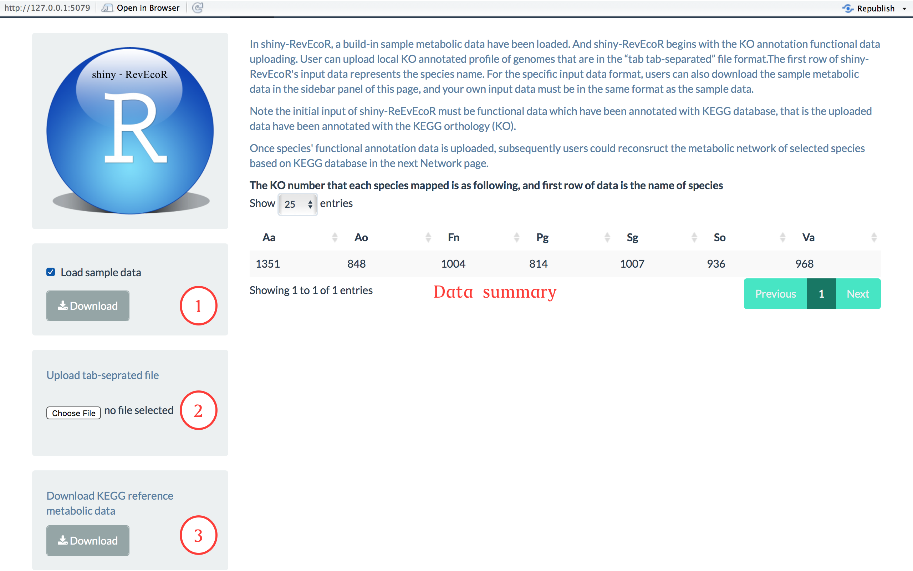

## Data input

**shiny-RevEcoR** begins with the  functional data that annotated with the KEGG orthology (KO) database. The details of input file format is as following:

- The input files must be "tab-separated" files.
- Different species mapped on diffenent number KO entries. We need Fill `NA` in the end for species mapped on less KOs, making different species' annotation files with the same length. Here, we provide a sample `R` code as following to achieve it:

```R
species1 <- data.frame(species1 = paste0('K',1:5))
species2 <- data.frame(species2 = paste0('K',1:4))
species3 <- data.frame(species3 = paste0('K',1:3))
if (require(gdata))
  sampledata <- cbindX(species1,species2,species3)

sampledata :

    species1 species2 species3
      K1       K1       K1
      K2       K2       K2
      K3       K3       K3
      K4       K4      <NA>
      K5      <NA>     <NA>
      
## then save this data as tab-seprated file which can be uploaded as the input file
write.table(sampledata, 'sampledata.tab', header = TRUE, 
  quote = FALSE, rwo.names = FALSE, sep = '\t')
```

- Each column of input data represents the KO annotation of a spicies-specific genome (or other taxons)
- Headers are required and should use the exact column names which represnets the species name, or an error will be raised in the following metabolic network reconstruction.
- Example dataset is available via `Download` button as in Fig1 `1`.

e.g.
```
species1  species2  ....
K00001    K00003    ....
K00002    K00004    ....
....      ....      ....
K02931    NA        NA
```

<br />

<p style = "text-align :center;">  </p>
<br />

<p style = "text-align :center;"><strong>Fig. Screenshot of Data panel of
shiny-RevEcoR</strong></p>

**shiny-RevEcoR** provides a built-in sample dataset and a `checkbox` to load it, as showing in Fig `1`. Or users could upload their own local annotation files with the same format as the sample data with `choose file` button as show in Fig `2`.

As mentioned above, KEGG database was used as the reference dataset for the following network construction, here, another `Download` button (Fig `3`) is described to download the reference metabolic data for local analyis. Furthermore, the right main panel shows the summary of input data.


